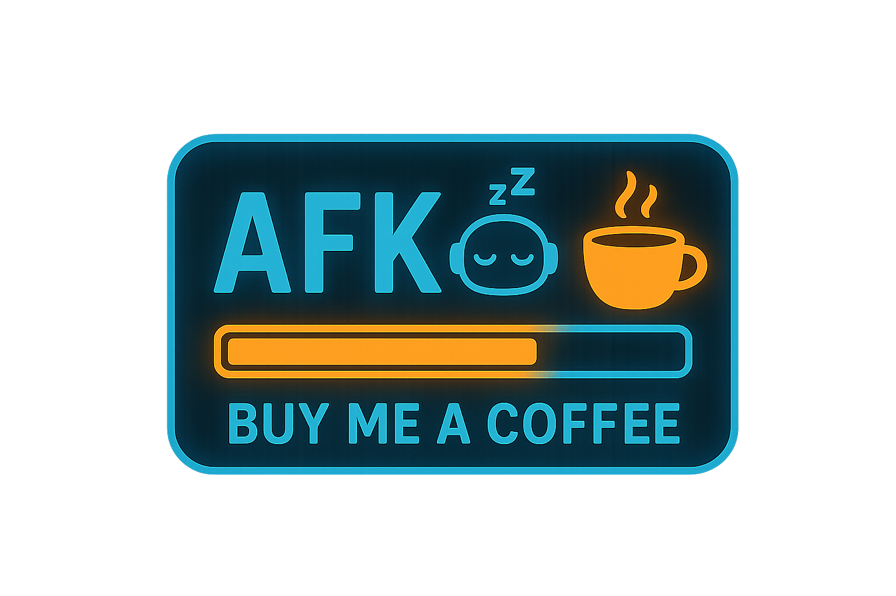

# AutoAFK Control Suite

[](https://buymeacoffee.com/rorrimaesu)

AutoAFK Control Suite is a Windows-native AFK choreographer that keeps your cursor orbiting a focal point while sprinkling in optional, human-like WASD taps. It layers smooth orbital math, procedural noise, and gentle cadence shifts to stay believable without looking chaotic. The glass-panel control deck GUI lets you tailor the motion profile before every session and ships ready-to-run as a bundled executable.

## Highlights

- **Procedural orbit paths** blending elliptical drift, smooth noise, and bias shifts so the camera never loops the same arc twice.
- **Optional "walkabout" footwork** that triggers short, infrequent WASD taps to mimic idle repositioning.
- **Micro-saccade jitter** with adjustable cadence for subtle human-like corrections that never cross the line into randomness.
- **Glass-panel control deck GUI** with toggles, sliders, and live telemetry for every motion parameter.
- **Global escape hatch**: press `Ctrl + Alt + Q` at any time to halt the choreography; `Ctrl + C` in the console remains a fallback.
- **Single-file executable build** via PyInstaller so you can keep an easy-to-launch copy in your AFK toolkit.

## Quick Start

1. Download or clone the repository and locate `dist/AutoAFK.exe`.
2. Double-click the executable. The interface launches full-screen with the latest visual polish and defaults.
3. Toggle **Walkabout footwork** or **Micro-saccade jitter**, then fine-tune orbit radius, camera pace, and cadence windows using the sliders and spin boxes.
4. Press **Engage Orbit**; a countdown primes the session before movement begins. Use **Abort Session** or `Ctrl + Alt + Q` to stop at any time.

### Interface Map

- **Session Personality**: enable or disable walkabout footwork and micro-saccade camera jitter.
- **Orbit Dynamics**: adjust radius, pace, and motion texture with synchronized sliders/spin boxes.
- **Session Envelope**: define startup countdown and screen margins for safe edges.
- **Cadence Windows**: set the min/max intervals for walkabout taps and micro-saccades.
- **Session Blueprint**: auto-updating summary plus live telemetry (status, progress, and quick hotkey reminders).
- **Control Bar**: one-click start/stop actions with clear accent and danger styling.

## Building the Standalone Executable

The repo already includes a ready-to-run binary in `dist/AutoAFK.exe`. Rebuilding is only required if you modify `mouse_orbit.py`.

```powershell
# Optional developer workflow
py -3 -m venv .venv
.venv\Scripts\Activate.ps1
.venv\Scripts\python.exe -m pip install pyinstaller
.venv\Scripts\pyinstaller.exe --onefile --name AutoAFK mouse_orbit.py
```

The resulting executable lives in `dist/AutoAFK.exe` and is safe to move alongside any supporting documentation. Keep the `build/` folder if you want faster incremental builds; otherwise it can be deleted after packaging.
## Technical Notes

- Uses Win32 `SendInput` for both relative mouse movement and virtual-key taps, which keeps the app responsive even in fullscreen DirectX titles.
- Run AutoAFK with elevated privileges when automating elevated games or applications so Windows does not block the injected input.
- Walkabout cadence and tap windows default to long intervals; tweak them sparingly for stealthier behaviour.
- The motion engine clamps movement to the active monitor with a configurable margin to avoid slamming cursor edges at high DPI.

## Safe Use & Etiquette

AutoAFK is designed for benign AFK presence simulation. Always respect game or application terms of service when automating input, and use the hotkey escape (`Ctrl + Alt + Q`) whenever you return to the keyboard to prevent unexpected movement.
