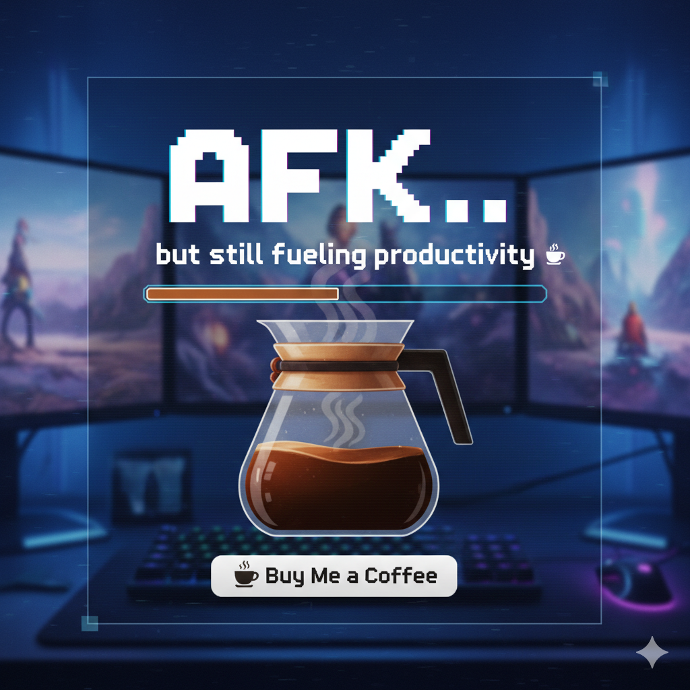

# AutoAFK Control Suite

[](https://buymeacoffee.com/rorrimaesu)

AutoAFK Control Suite is a Windows-native AFK choreographer that keeps your cursor orbiting a focal point while sprinkling in optional, human-like WASD taps. It layers smooth orbital math, procedural noise, and gentle cadence shifts to stay believable without looking chaotic. A console control deck lets you tailor the motion profile before every session.

## Highlights

- **Procedural orbit paths** blending elliptical drift, smooth noise, and bias shifts so the camera never loops the same arc twice.
- **Optional "walkabout" footwork** that triggers short, infrequent WASD taps to mimic idle repositioning.
- **Micro-saccade jitter** with adjustable cadence for subtle human-like corrections that never cross the line into randomness.
- **Glass-panel control deck GUI** with toggles, sliders, and live telemetry for every motion parameter.
- **Global escape hatch**: press `Ctrl + Alt + Q` at any time to halt the choreography; `Ctrl + C` in the console remains a fallback.
- **Single-file executable build** via PyInstaller so you can keep an easy-to-launch copy in your AFK toolkit.

## Quick Start

1. (Optional) Create and activate a virtual environment, then install PyInstaller if you intend to build the executable:
   ```powershell
   py -3 -m venv .venv
   .venv\Scripts\Activate.ps1
   .venv\Scripts\python.exe -m pip install pyinstaller
   ```
2. Launch the AutoAFK Control Suite GUI using Python or the packaged executable:
   ```powershell
   # From source
   .venv\Scripts\python.exe mouse_orbit.py

   # Or run the packaged binary (after building once)
   dist\AutoAFK.exe
   ```
3. In the control deck, adjust the toggles, sliders, and cadence windows, then click **Engage Orbit**.
4. Position the mouse over the point you want to orbit. AutoAFK handles the countdown, begins the choreography, and listens for `Ctrl + Alt + Q` (or the **Abort Session** button) to stop.

## Control Deck Options

| Option | Description |
| ------ | ----------- |
| 1 | Start a session with the current profile. |
| 2 | Toggle walkabout footwork (WASD taps). |
| 3 | Toggle micro-saccade jitter. |
| 4 | Adjust orbit radius (pixels). |
| 5 | Adjust camera pace (radians per second). |
| 6 | Adjust motion texture (jitter amplitude). |
| 7 | Set the startup countdown delay. |
| 8 | Define the interval window for walkabout cadence. |
| 9 | Define the tap length window for footwork. |
| 10 | Define the interval window for micro-saccades. |
| 11 | Set the safety margin from screen edges. |
| 12 | Restore curated defaults. |
| S | Display a detailed configuration blueprint. |
| Q | Exit the suite. |

All numeric prompts accept Enter to keep the current value. Range prompts take comma-separated values (e.g., `6.5,12.0`).

## Building the Standalone Executable

AutoAFK ships as a single Python file with only standard-library dependencies. Once PyInstaller is installed, rebuild the binary after any code change with:

```powershell
.venv\Scripts\pyinstaller.exe --onefile --name AutoAFK mouse_orbit.py
```

The resulting executable lives in `dist/AutoAFK.exe` and is safe to move alongside any supporting documentation. Keep the `build/` folder if you want faster incremental builds; otherwise it can be deleted after packaging.
## Technical Notes

- Uses Win32 `SendInput` for both relative mouse movement and virtual-key taps, which keeps the app responsive even in fullscreen DirectX titles.
- Run AutoAFK with elevated privileges when automating elevated games or applications so Windows does not block the injected input.
- Walkabout cadence and tap windows default to long intervals; tweak them sparingly for stealthier behaviour.
- The motion engine clamps movement to the active monitor with a configurable margin to avoid slamming cursor edges at high DPI.

## Safe Use & Etiquette

AutoAFK is designed for benign AFK presence simulation. Always respect game or application terms of service when automating input, and use the hotkey escape (`Ctrl + Alt + Q`) whenever you return to the keyboard to prevent unexpected movement.
